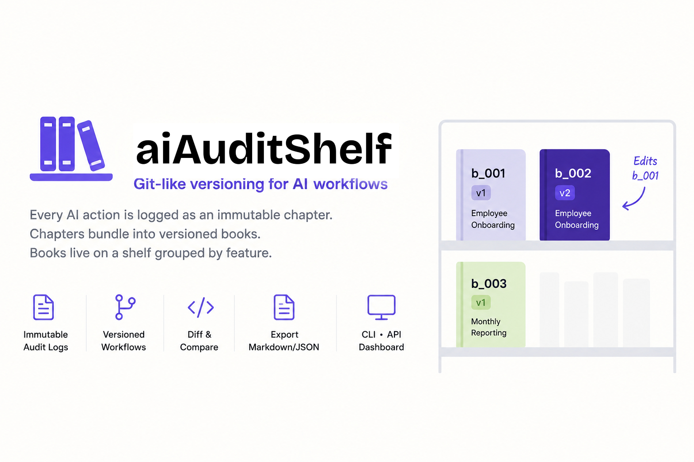

**Git-like versioning for AI workflows, organized as books and chapters.**

Every AI action gets logged as an immutable "chapter." Chapters bundle into "books" (versioned features). Books live on a "shelf" grouped by feature. Edit a feature? A new edition is created — the old one stays as a permanent audit trail.

Repository: [github.com/ATHARVA262005/ai-audit-shelf](https://github.com/ATHARVA262005/ai-audit-shelf)

> ⭐️ **If you find this project useful, please consider giving it a star!**  
> [ATHARVA262005/ai-audit-shelf](https://github.com/ATHARVA262005/ai-audit-shelf)

[](https://github.com/ATHARVA262005/ai-audit-shelf/stargazers)
[](https://github.com/ATHARVA262005/ai-audit-shelf/network/members)
[](https://github.com/ATHARVA262005/ai-audit-shelf/issues)
[](https://github.com/ATHARVA262005/ai-audit-shelf/graphs/contributors)
[](LICENSE)
[](https://gssoc.girlscript.tech/)

```
Library
  └── [Feature: HR Automation]
        ├── b_001 v1  Employee Onboarding (4 chapters)
        └── b_002 v2  Employee Onboarding (5 chapters)  ← edits b_001
  └── [Feature: Reporting]
        └── b_003 v1  Monthly Reporting (3 chapters)
```

---

## Why

AI workflows are opaque. Prompts go in, results come out, and nobody can trace what happened. AI Audit gives you:

- **Full audit trail** — every prompt, result, actor, and timestamp is immutable
- **Feature-level versioning** — edits create new editions, old ones are preserved
- **Human-readable exports** — JSON for machines, Markdown for auditors
- **Works everywhere** — CLI, REST API, web dashboard, or one-line SDK calls

---

## Operator Guide

If you are introducing AI Audit Shelf to a founder, operator, or non-technical teammate, start with the audit problem before the book/chapter metaphor:

- [Audit UX for operators](docs/audit-ux-for-operators.md)

---

## Quick Start

### Prerequisites

- Python 3.10+
- No external dependencies for CLI (stdlib only)
- `fastapi` and `uvicorn` for the API server

```bash
pip install fastapi uvicorn
```

---

### 1. CLI

Log actions, bundle into books, browse the shelf.

```bash
# Log chapters
python cli.py add-chapter "Summarize Q1 sales" "Revenue up 15%" --actor alice --source claude
python cli.py add-chapter "Email report to team" "Sent to 5 managers" --actor bob --source copilot

# Bundle into a book
python cli.py create-book "Q1 Reporting" c_001 c_002 --feature "Reporting"

# Browse
python cli.py shelf
python cli.py show-book b_001
python cli.py list-chapters

# Create a new edition when requirements change
python cli.py add-chapter "Add regional breakdown" "APAC +22%, EMEA +8%" --actor alice --source claude
python cli.py new-edition b_001 --chapter-ids c_001 c_002 c_003

# Diff editions
python cli.py diff-books b_001 b_002

# Export for auditors
python cli.py export-book b_001 --format markdown
python cli.py export-book b_001 --format json

# Search
python cli.py search-chapters --actor alice
python cli.py search-chapters --keyword "sales"
python cli.py search-chapters --after "2026-05-01"
```

---

### 2. API Server

Start the server, then call it from any tool or language.

```bash
python api.py
```

Server runs at `http://localhost:8000`. Interactive docs at `http://localhost:8000/docs`.

```bash
# Log a chapter
curl -X POST "http://localhost:8000/chapter?prompt=Analyze+reviews&result=85%25+positive&actor=agent&source=langchain"

# Create a book (title/feature as query params, chapter_ids as JSON body)
curl -X POST "http://localhost:8000/book?title=Review%20Analysis&feature=Reviews" \
  -H "Content-Type: application/json" \
  -d '["c_001", "c_002"]'

# Browse
curl http://localhost:8000/shelf
curl http://localhost:8000/books
curl http://localhost:8000/chapters

# Diff two editions
curl "http://localhost:8000/diff/books?id_a=b_001&id_b=b_002"

# Export
curl "http://localhost:8000/export/book/b_001?format=markdown"
```

**Auth (optional):** Set `AUDIT_API_KEY` env var to require `X-API-Key` header on write endpoints.

```bash
export AUDIT_API_KEY=secret123
# Now POST requests need: -H "X-API-Key: secret123"
```

---

### 3. Web Dashboard

Visual interface for browsing, searching, and diffing.

```bash
# Start the API server
python api.py

# Open the dashboard
open dashboard.html    # macOS
start dashboard.html   # Windows
xdg-open dashboard.html  # Linux
```

The dashboard connects to `http://localhost:8000` and provides:

- **Library** — bookshelf grouped by feature
- **Books** — table view with export buttons
- **Chapters** — full audit log with detail view
- **Search** — filter by actor, keyword, date
- **Diff** — compare two editions side-by-side

> **API URL config:** If your API server runs on a different port or host, type the URL into the input at the bottom of the sidebar. The value is saved in your browser and persists across reloads.

---

### 4. Agent Demo

See how any AI workflow plugs into the audit system.

```bash
# Terminal 1: start the server
python api.py

# Terminal 2: run the demo
python demo_agent.py
```

The demo simulates a "Product Review Automation" workflow — 4 steps, each logged as a chapter, then bundled into a book. The pattern is the same for any agent.

---

## Integration Recipes

### Python — requests (any framework)

```python
import requests

API = "http://localhost:8000"

def log_chapter(prompt: str, result: str, actor: str = "my-agent") -> str:
    """Log an action. Returns the chapter ID."""
    resp = requests.post(f"{API}/chapter", params={
        "prompt": prompt,
        "result": result,
        "actor": actor,
        "source": "my-app",
    })
    return resp.json()["chapter"]["id"]

def bundle_book(title: str, chapter_ids: list[str], feature: str = "") -> dict:
    """Bundle chapters into a book."""
    resp = requests.post(f"{API}/book", params={
        "title": title,
        "feature": feature or title,
    }, json=chapter_ids)
    return resp.json()["book"]

# Usage
c1 = log_chapter("Translate doc to Spanish", "Translation complete, 2400 words")
c2 = log_chapter("Review translation quality", "Score: 94/100, 3 minor corrections")
book = bundle_book("Translation Pipeline", [c1, c2])
print(f"Created {book['id']}")
```

---

### LangChain — Callback Handler

```python
from langchain.callbacks.base import BaseCallbackHandler
import requests

API = "http://localhost:8000"

class AuditCallbackHandler(BaseCallbackHandler):
    """Logs every LLM call to the AI Audit server."""

    def __init__(self, actor: str = "langchain-agent"):
        self.actor = actor
        self._chapters = []

    def on_llm_end(self, response, **kwargs):
        prompt = response.generations[0][0].text if response.generations else ""
        chapter_id = self._log(
            prompt=str(kwargs.get("prompts", [""]))[0],
            result=prompt,
        )
        self._chapters.append(chapter_id)

    def on_tool_end(self, output: str, **kwargs):
        chapter_id = self._log(
            prompt=f"Tool: {kwargs.get('name', 'unknown')}",
            result=output[:2000],
        )
        self._chapters.append(chapter_id)

    def _log(self, prompt: str, result: str) -> str:
        resp = requests.post(f"{API}/chapter", params={
            "prompt": prompt,
            "result": result,
            "actor": self.actor,
            "source": "langchain",
        })
        return resp.json()["chapter"]["id"]

    def bundle(self, title: str, feature: str = "") -> dict:
        """Bundle all logged chapters into a book."""
        resp = requests.post(f"{API}/book", params={
            "title": title,
            "feature": feature or title,
        }, json=self._chapters)
        return resp.json()["book"]


# Usage
from langchain.chat_models import ChatOpenAI
from langchain.agents import initialize_agent, Tool

handler = AuditCallbackHandler(actor="support-bot")

llm = ChatOpenAI(model="gpt-4", callbacks=[handler])
agent = initialize_agent(
    tools=[Tool(name="Search", func=lambda q: "results...", description="Search docs")],
    llm=llm,
    callbacks=[handler],
)

agent.run("Find the refund policy for EU customers")
handler.bundle("EU Refund Lookup", feature="Support Automation")
```

---

### OpenAI — Function Calls

```python
from openai import OpenAI
import requests
import json

API = "http://localhost:8000"
client = OpenAI()

def log_chapter(prompt: str, result: str) -> str:
    resp = requests.post(f"{API}/chapter", params={
        "prompt": prompt,
        "result": result,
        "actor": "openai-agent",
        "source": "openai",
    })
    return resp.json()["chapter"]["id"]

def run_with_audit(user_message: str):
    """Run an OpenAI call with full audit logging."""
    # Log the request
    response = client.chat.completions.create(
        model="gpt-4",
        messages=[{"role": "user", "content": user_message}],
        tools=[{
            "type": "function",
            "function": {
                "name": "get_weather",
                "description": "Get current weather",
                "parameters": {
                    "type": "object",
                    "properties": {"location": {"type": "string"}},
                },
            },
        }],
    )

    msg = response.choices[0].message
    result = msg.content or json.dumps(msg.tool_calls[0].function.model_dump())

    chapter_id = log_chapter(prompt=user_message, result=result)
    print(f"Logged as {chapter_id}")
    return result

# Usage
run_with_audit("What's the weather in Tokyo?")
```

---

### LlamaIndex — Callback Handler

```python
import requests
from typing import Optional, Dict, List, Any
from llama_index.core.callbacks import CallbackManager, CBEventType
from llama_index.core.callbacks.base_handler import BaseCallbackHandler
from llama_index.core.callbacks.schema import EventPayload  # Requires llama-index-core >= 0.10

API = "http://localhost:8000"


class AuditCallbackHandler(BaseCallbackHandler):
    """Logs LlamaIndex query and LLM synthesis events to the AI Audit server."""

    def __init__(self, actor: str = "llamaindex-agent"):
        # Ignore background noise (chunking, tokenization, embedding) — track only QUERY and LLM
        all_events = list(CBEventType)
        all_events.remove(CBEventType.QUERY)
        all_events.remove(CBEventType.LLM)

        super().__init__(
            event_starts_to_ignore=all_events,
            event_ends_to_ignore=all_events,
        )
        self.actor = actor
        self._chapters: List[str] = []
        self._event_prompts: Dict[str, str] = {}

    def on_event_start(
        self,
        event_type: CBEventType,
        payload: Optional[Dict[str, Any]] = None,
        event_id: str = "",
        **kwargs,
    ) -> str:
        if not payload:
            return event_id

        if event_type == CBEventType.QUERY:
            self._event_prompts[event_id] = payload.get(EventPayload.QUERY_STR, "")
        elif event_type == CBEventType.LLM:
            messages = payload.get(EventPayload.MESSAGES, [])
            prompt = payload.get(EventPayload.PROMPT, "")
            # Handle both chat message lists and raw prompt strings
            self._event_prompts[event_id] = str(messages[0]) if messages else str(prompt)

        return event_id

    def on_event_end(
        self,
        event_type: CBEventType,
        payload: Optional[Dict[str, Any]] = None,
        event_id: str = "",
        **kwargs,
    ) -> None:
        if not payload:
            return

        prompt = self._event_prompts.pop(event_id, "")
        result = ""

        if event_type == CBEventType.QUERY:
            response = payload.get(EventPayload.RESPONSE)
            result = str(response) if response else ""

        elif event_type == CBEventType.LLM:
            response = payload.get(EventPayload.RESPONSE)
            if response:
                # Handle both ChatResponse (.message.content) and CompletionResponse (.text)
                if hasattr(response, "message") and response.message:
                    result = response.message.content
                elif hasattr(response, "text"):
                    result = response.text
                else:
                    result = str(response)

        if prompt or result:
            chapter_id = self._log(prompt=prompt, result=result, event_type=event_type.value)
            if chapter_id:
                self._chapters.append(chapter_id)

    def _log(self, prompt: str, result: str, event_type: str = "") -> Optional[str]:
        try:
            resp = requests.post(
                f"{API}/chapter",
                params={
                    "prompt": f"[{event_type}] {prompt}"[:2000],
                    "result": result[:2000],
                    "actor": self.actor,
                    "source": "llamaindex",
                },
                timeout=5,
            )
            resp.raise_for_status()
            return resp.json()["chapter"]["id"]
        except Exception as e:
            print(f"Failed to log event to AI Audit server: {e}")
            return None

    def bundle(self, title: str, feature: str = "") -> dict:
        """Bundle all logged chapters into a book and clear tracking state."""
        if not self._chapters:
            return {"message": "No chapters logged to bundle."}

        try:
            resp = requests.post(
                f"{API}/book",
                params={
                    "title": title,
                    "feature": feature or title,
                },
                json=self._chapters,
                timeout=5,
            )
            resp.raise_for_status()
            book = resp.json()["book"]
            # Clear state only after a successful bundle
            self._chapters = []
            self._event_prompts = {}
            return book
        except Exception as e:
            print(f"Failed to bundle chapters: {e}")
            return {}

    def start_trace(self, trace_id: Optional[str] = None) -> None:
        pass

    def end_trace(
        self,
        trace_id: Optional[str] = None,
        trace_map: Optional[Dict[str, List[str]]] = None,
    ) -> None:
        pass


# Usage Example
from llama_index.core import VectorStoreIndex, SimpleDirectoryReader, Settings

# 1. Initialize the handler — indexing noise is filtered out automatically
handler = AuditCallbackHandler(actor="rag-pipeline")
Settings.callback_manager = CallbackManager([handler])

# 2. Build the index and query engine (chunking/embedding events are ignored)
documents = SimpleDirectoryReader("./docs").load_data()
index = VectorStoreIndex.from_documents(documents)
query_engine = index.as_query_engine()

# 3. Execute queries — handler fires only for QUERY and LLM events
response = query_engine.query("What are the key findings in Q1?")
print(response)

# 4. Bundle all logged chapters into a book 
book = handler.bundle("Q1 RAG Query", feature="RAG Automation")
print(f"Audited successfully! Book created: {book.get('id')}")
```

---

### Shell Script

```bash
#!/bin/bash
# audit-wrap.sh — wrap any command and log its execution

API="http://localhost:8000"
ACTOR="${AUDIT_ACTOR:-shell}"
PROMPT="$1"
shift
RESULT=$("$@" 2>&1)
EXIT_CODE=$?

# Log to audit server
CHAPTER_ID=$(curl -s -X POST "$API/chapter" \
  --data-urlencode "prompt=$PROMPT" \
  --data-urlencode "result=$RESULT" \
  --data-urlencode "actor=$ACTOR" \
  --data-urlencode "source=shell" \
  | python -c "import sys,json; print(json.load(sys.stdin)['chapter']['id'])")

echo "Audit: $CHAPTER_ID (exit $EXIT_CODE)"
exit $EXIT_CODE
```

Usage:

```bash
# Wrap any command
./audit-wrap.sh "Deploy to staging" ./deploy.sh staging
./audit-wrap.sh "Run test suite" pytest tests/

# Set a custom actor
AUDIT_ACTOR="ci-bot" ./audit-wrap.sh "Build release" make build
```

---

### curl (any language)

```bash
# Log a chapter
curl -X POST "http://localhost:8000/chapter" \
  -G \
  --data-urlencode "prompt=Analyze customer churn" \
  --data-urlencode "result=Churn rate: 4.2%, down from 5.1%" \
  --data-urlencode "actor=data-agent" \
  --data-urlencode "source=custom"

# Create a book (title/feature as query params, chapter_ids as JSON body)
curl -X POST "http://localhost:8000/book?title=Churn%20Analysis%20Q1&feature=Analytics" \
  -H "Content-Type: application/json" \
  -d '["c_001", "c_002", "c_003"]'
```

---

## Project Structure

```
aiAudit/
├── models.py         # Chapter and Book dataclasses
├── db.py             # SQLite storage layer
├── cli.py            # CLI (11 commands)
├── api.py            # FastAPI server (11 endpoints)
├── dashboard.html    # Web UI (single file, no build)
├── demo_agent.py     # Integration demo
└── audit.db          # SQLite database (auto-created)
```

---

## API Reference

| Method | Endpoint | Description |
|--------|----------|-------------|
| POST | `/chapter` | Log a new chapter |
| GET | `/chapters` | List all chapters |
| GET | `/chapter/{id}` | Get a chapter by ID |
| GET | `/search/chapters` | Search by actor, keyword, date |
| POST | `/book` | Create a book from chapter IDs |
| GET | `/books` | List all books |
| GET | `/book/{id}` | Get a book by ID |
| POST | `/book/{id}/edition` | Create new edition (version bump) |
| GET | `/export/book/{id}` | Export as JSON or `?format=markdown` |
| GET | `/diff/books` | Compare two books (`?id_a=X&id_b=Y`) |
| GET | `/shelf` | Library grouped by feature |

Full interactive docs at `http://localhost:8000/docs` when the server is running.

---

---

## Contributors

Thanks to everyone who has contributed to this project! 🎉

[](https://github.com/ATHARVA262005/ai-audit-shelf/graphs/contributors)

---

## Roadmap

We are actively developing the next version of AI Audit Shelf, focusing heavily on **reproducibility** and **agent pipeline safety**. Here is what we are building next (inspired directly by community feedback!):

* 🧪 **First-Class Reproducibility Parameters:** First-class database support for tracking generation metadata (`model_version`, `temperature`, `seed`, `top_p`) so prompt differences are deterministic.
* 🛑 **Verification & Validation Gates:** Integration of synchronous and asynchronous validation callbacks (hooks) to halt execution flows and flag errors before prompt drift propagates downstream.
* 🔗 **Contextual Session Tracking:** Automatic linking of prompt versions directly to the originating user `session_id` or failing execution context.
* 📦 **Docker Support:** Containerized deployment templates for single-command self-hosting.

Want to help shape these features? Join the discussion on our [Issues tracker](https://github.com/ATHARVA262005/ai-audit-shelf/issues)!

---

## Contributing


All contributions are welcome — from fixing a typo to adding a full integration recipe.

### Ways to contribute

| Type | How |
|---|---|
| 🐛 Bug fix | Open an issue, then a PR |
| 📖 Docs / Recipe | Add an integration example to the README |
| ✨ Feature | Open an issue first to discuss |
| ⭐ No code? | Star the repo — it helps more people find it |

### Good first issues

Looking for a place to start? Check the [`good first issue`](https://github.com/ATHARVA262005/ai-audit-shelf/issues?q=is%3Aissue+is%3Aopen+label%3A%22good+first+issue%22) label — these are small, well-defined tasks perfect for first-time contributors.

### How to submit a PR

```bash
# 1. Fork the repo and clone your fork
git clone https://github.com/<your-username>/ai-audit-shelf
cd ai-audit-shelf

# 2. Create a branch
git checkout -b feat/your-feature-name

# 3. Make your changes and commit
git commit -m "feat: describe your change"

# 4. Push and open a PR against main
git push origin feat/your-feature-name
```

For questions, open a [discussion](https://github.com/ATHARVA262005/ai-audit-shelf/discussions) or reach out to [@ATHARVA262005](https://github.com/ATHARVA262005).

---

## License

MIT — see [LICENSE](LICENSE)
