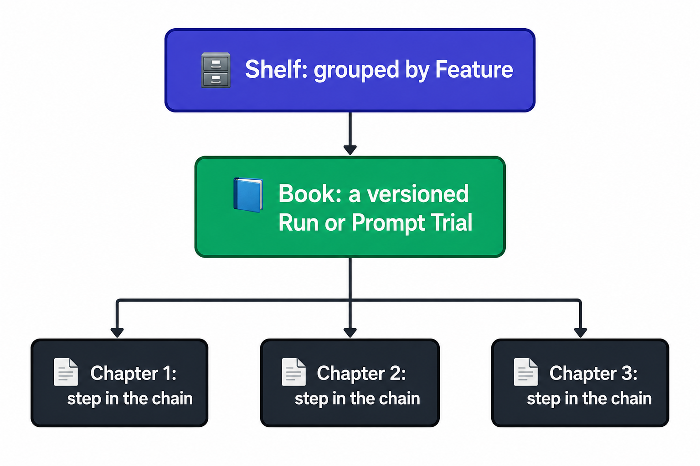

# 🚀 Early Adopters & Metaphor Guide: Demystifying AI Audit Shelf

If you have ever built an LLM-powered application, agent chain, or prompt engineering pipeline, you already know the core problem: **AI workflows are a black box.** 

Prompts change, model responses drift, validation rules fail silently, and when a client reports a bug, there is **zero historical trace** or Git-like history of what actually transpired. 

**AI Audit Shelf** is a lightweight, zero-overhead, production-grade audit layer that captures every prompt, response, model parameter, and safety check—packaging it into a beautiful, human-readable metaphorical library.

---

## 📖 The "Library" Metaphor Made Simple

To make auditing intuitive, we map abstract MLOps concepts to objects you find in a real-world library:

### 1. 📄 The Chapter (An Atomic LLM Run)
A **Chapter** is a single logged LLM interaction. It contains the raw input, the raw output, and rich metadata for reproducibility:
* **The Story:** What went in (`prompt`) and what came out (`result`).
* **The Author:** Who triggered it (`actor`, e.g., `user_183` or `billing_agent`).
* **The Instrument:** The engine used (`model`, `temperature`, `seed`, and `source` SDK).
* **The Editor:** Real-time **Validation Gates** that test if the response was a valid JSON document, contained necessary keywords, or matched safe regex bounds.

### 📘 2. The Book (A Logical Workflow Edition)
An AI workflow is rarely just one prompt. An agent might search a database, summarize the results, and draft an email. 
A **Book** bundles these consecutive **Chapters** into a single structured story.
* Edits or changes in prompt logic create **new editions** of the Book (e.g. Edition 1 &rarr; Edition 2). 
* Older runs are kept as immutable parent records, giving you a full, chronological prompt-engineering history.

### 🗄️ 3. The Shelf (The Feature Catalog)
A **Shelf** groups your versioned Books by their actual technical feature (e.g., `Customer Support Bot`, `Sales Lead Summarizer`, `Invoice Parser`). 
This allows you to browse all versions of a specific workflow run side-by-side in your dashboard.

---

## 💡 Real-World Scenarios: How People Use It Right Now

### Scenario A: Prompt Tuning & Regression Tracking
> **The Pain:** You tweak a system prompt to make your chatbot friendlier, but suddenly it starts hallucinating in steps 3 and 4 of your user chat.
* **The AI Audit Solution:** You run a visual **Semantic Diff Comparison**. The CLI (`audit diff-books`) or the Web Dashboard shows you a color-coded line-by-line diff of the prompt changes alongside a side-by-side comparison of the model output deltas. You spot the regression in 5 seconds.

### Scenario B: GDPR & Compliance Audits
> **The Pain:** A business customer asks: *"Why did your AI support agent issue a refund to a client who did not qualify?"*
* **The AI Audit Solution:** You search your logs by keyword or actor (`audit search-chapters --actor support_agent`). You export the immutable Book as a clean, polished Markdown document (`audit export-book b_001 --format markdown`) and hand it directly to the compliance auditor or customer.

### Scenario C: Enforcing Structured JSON Formats
> **The Pain:** Your AI pipeline expects a structured JSON object, but the model occasionally spits out plain text or broken markdown syntax, crashing your downstream code.
* **The AI Audit Solution:** You attach a **Validation Gate** check. Every chapter validation reports in real-time. If a run outputs invalid JSON, it is badged red instantly in the Telemetry Dashboard, alerting your engineering team before your customer sees a crash.

---

## 🛠️ The Early Adopters' Checklist

Ready to deploy this in your stack? Follow our 5-minute integration path:

- [ ] **1. Run the Server:** Boot `python api.py` locally or host it on your cloud environment (AWS, GCP, Render).
- [ ] **2. Seed the Demo Agent:** Execute `python demo_agent.py` to see a simulated 4-step AI pipeline log its audit trail in real-time.
- [ ] **3. View the Dashboard:** Double-click `dashboard.html` in your browser to inspect the gorgeous MLOps metrics, validation summaries, and side-by-side prompt diffs!
- [ ] **4. Wire Your Own App:** Integrate using any language (Python, Node.js, Go) by calling the simple REST API endpoints documented at `http://localhost:8000/docs`.

---

> [!NOTE]
> AI Audit Shelf is fully local, light-weight, and zero-dependency for terminal clients. Your prompt records never leave your own server, guaranteeing complete data privacy and GDPR compliance.
